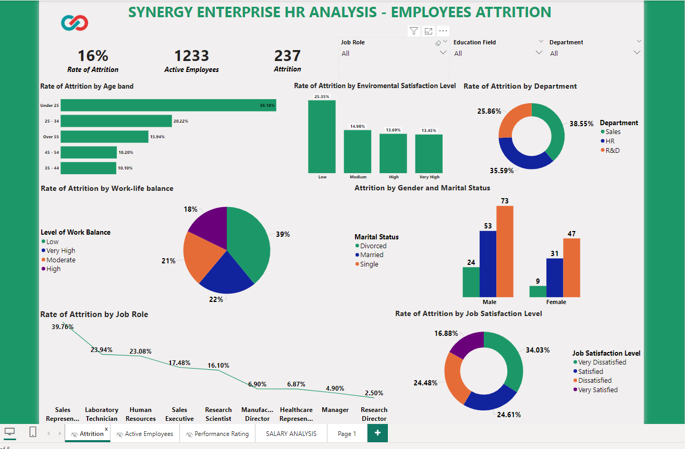
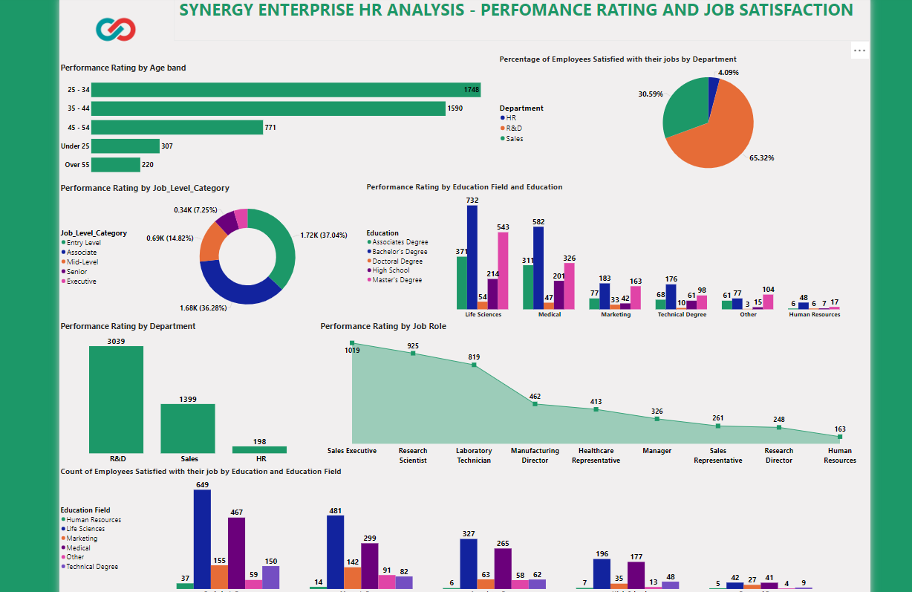
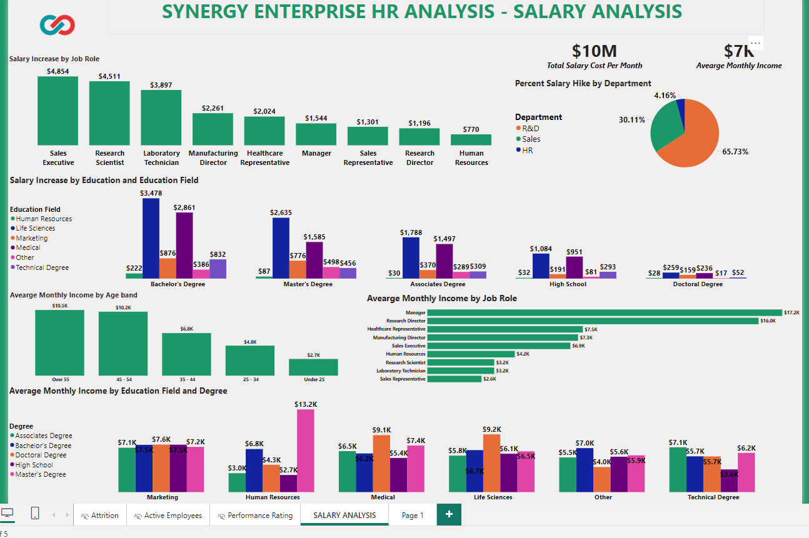

# SYNERGY ENTERPRISE HR ANALYSIS

---

## Introduction  
Within the highly competitive world of technology consulting, where skill and creativity are essential for success, Synergy Enterprise is distinguished as a leader dedicated to establishing new benchmarks for the sector. Understanding the importance of human capital management (HCM) for maintaining competitiveness and growth (Hollenbeck et al., 2019), the Australian-based Synergy Enterprise firm exemplifies resilience and adaptation in the face of quick technology improvements.  
Synergy Enterprise recognizes that in order to properly optimize our HCM initiatives, strategic insights are necessary in the constant quest of excellence. Consequently, the purpose of this analysis is to use Power BI to examine our workforce dynamics and address important issues in the technology consulting industry, including attrition, wage trends, job satisfaction, and demographics. Through rigorous analysis and evidence-based recommendations, we seek to fortify our strategies, cultivate a thriving workplace environment, and ensure continued success in this dynamic industry landscape. 

## Statement of the problem 
Human capital management (HCM) presents difficulties for Synergy Enterprise, mainly in relation to employee attrition, wage trends, job satisfaction, and demographics.  
Customer satisfaction and organizational continuity are negatively impacted by attrition rates within particular departments and populations. Salary disparities between occupations and educational levels generate concerns about fair compensation policies and worker happiness. Changes in the degree of job satisfaction indicate possible dissatisfaction, which impacts worker productivity and organizational effectiveness. Further research is necessary since demographic variables including age, gender, and marital status may have an impact on work satisfaction and attrition rates.  
In order to ensure Synergy Enterprise’ continued success and growth in the technology consulting industry, addressing these issues necessitates a complete HCM strategy study to detect trends and actions.  

**_Using the following Power BI skills_**
- DAX
- Quick Measures
- Filters
- Modelling

**_Modelling_**
Automatically derived relationships are  adjusted to remove and replace unwanted relationships with the required.

## Data Source & Findings
Synergy Enterprise first transferred the data findings from Data-world into Excel format before cleaning and analyzing them. Important information about attrition patterns, salary trends, job satisfaction, performance ratings of active employees, retention, and job satisfaction surfaced. These insights helped shape strategies for maximizing human capital management and promoting organizational success. 

## Data Transformation
A number of adjustments were made to improve the analysis's capabilities. First, in order to guarantee proper computations and visualizations, some columns needed to have their data types changed. We transformed numerical data about performance ratings, work satisfaction levels, and environmental satisfaction into categorical data and categorized them into low, medium, high, and very high groups. To make comparison and trend identification easier, these categories were also given ranks according to their 
significance or influence. These changes made it possible to analyze attrition, job satisfaction, retention, and compensation trends more deeply, which aided in the development of successful strategies for human resource management and organizational performance. 

## Data Information
The offered dataset includes a wide range of employee-related data that is necessary for in-depth examination and organizational decision-making. Data on a number of topics are covered, including work-life balance evaluations, employee demographics, job roles, pay information, and tenure-related variables. When taken as a whole, these data points offer insightful information about organizational dynamics, job-related characteristics, compensation patterns, and employee demographics. By analyzing this dataset, strategic planning and wellinformed decision-making may be addressed with regard to employee satisfaction, retention, and overall organizational performance. 

                                                                                                 *#ANALYSIS*

# Attrition Analyses  

---

## By Age
 Attrition rates by age group provide important insights into labor dynamics. Visualization of the data using a clustered bar chart facilitates easy comparisons between age groups. Workers under 25 had the highest attrition rate (39.18%), which could be attributed to things like career exploration. The rate is lower for individuals between the ages of 25 and 34 (20.22%), which probably reflects more established professional routes. Similar attrition rates of 10% are seen among workers in the 35–44 and 45– 55 age groups, indicating stability and contentment. Employees over 55 had the lowest attrition rate (15.94%), maybe as a result of retirement planning. The clustered bar chart effectively illustrates these trends, aiding stakeholders in identifying areas of concern and strength and supporting data-driven decision-making for targeted talent retention strategies. 

## By Department
  This provides important insights into workforce dynamics. Attrition rates are efficiently communicated in a visually striking way when visualized using a gauge chart. At 38.55%, the sales department has the greatest turnover rate, maybe as a result of the rigorous nature of sales roles. In contrast, the HR department's slightly lower attrition rate of 35.59% may be a reflection of the company's culture and prospects for career advancement. With a rate of 25.86%, the Research and Development (R&D) department has the lowest attrition rate. This is probably because of things like innovation and a positive work atmosphere. Thus, the gauge chart highlights attrition challenges in each department, facilitating data-driven decision-making and targeted interventions to enhance employee retention and organizational performance. 

## By Environmental Satisfaction Level

 This Provides an important insights into staff retention elements that come from the 
analysis of attrition rates based on environmental satisfaction levels.  
The high attrition rate of 25.35% among workers with poor environmental satisfaction ratings suggests that there may be job unhappiness.  
An average degree of happiness with the work environment is shown by the reduced attrition rate 
of 14.98% among those with medium environmental satisfaction levels.  
The attrition rate of 13.45% is marginally lower among workers who report very high levels of environmental satisfaction, suggesting room for improvement in the workplace.  
Stakeholders can evaluate the overall effect of workplace perceptions on employee retention by using a column chart, which depicts these attrition trends.  

## By Gender and Marital Status

This analysis of attrition by gender and marital status at Synergy Enterprise sheds light on employee turnover across different demographic groups. 
Using a clustered column chart, the breakdown of attrition numbers reveals: 

- Divorced Males: 24 
- Married Males: 53 
- Single Males: 73 
- Divorced Females: 9 
- Married Females: 31 
- Single Females: 47 

Stakeholders can quickly see any notable differences or trends in attrition rates depending on gender and marital status by comparing attrition figures side by side using this visualization method. Indicating a possible area of worry or a chance to investigate turnover issues within this demography, the chart can, for instance, show that single males have the highest number of attrition instances. Gender-specific retention issues can be better understood by comparing the attrition rates of men and women within each category of marital status. 

# Active Employees Analysis 

---

## Active Employees by Education Field and Degree: 

The data presents the number of employees with different educational backgrounds across various departments at Synergy Enterprise. Utilizing a clustered column chart is justified for visualizing this data as it allows for clear comparisons between the educational levels within each department. Here is the breakdown of employees by educational background and department
This visualization will allow stakeholders to compare the distribution of employees' educational backgrounds across different departments briefly, facilitating insights into workforce composition and potential talent development strategies. 

## Percentage of Active Employees by Environmental Satisfaction Level

The chart in figure 11 below displays the distribution of active employees by their environmental satisfaction levels at Synergy Enterprise: 
-	High Satisfaction: 32% 
-	Very High Satisfaction: 31% 
-	Medium Satisfaction: 20% 
-	Low Satisfaction: 17%
  
Using a pie chart for visualization is justified because it allows for clear comparison, summarized representation, visual emphasis, and highlighting key insights. This chart effectively communicates the distribution of employees across satisfaction levels, aiding in decision-making for enhancing employee satisfaction and engagement. 

## Active Employee by Work-life Balance Level

The analysis of work-life balance satisfaction among active employees of Synergy Enterprise provides important insights into organizational dynamics and employee well-being, as shown in figure 12 below. Results show that 62% of respondents are very satisfied, suggesting a supportive work-life culture. Furthermore, 23% report moderate pleasure, indicating tolerable worries. A lesser but significant 10% claim extremely high satisfaction, while 4% report low satisfaction, pointing out areas in need of improvement. These results are efficiently communicated through the use of a donut chart, which provides a succinct summary of the satisfaction levels with work-life balance. 

# Performance Rating Analysis 

---

## Performance Rating by Education Field and Education Level

The relationship between academic success and employment performance is clarified by analyzing Synergy Enterprise's performance evaluations according to degree level and educational field. Holders of bachelor's and master's degrees in the medical area and life sciences typically get better performance ratings, suggesting a beneficial relationship between specialized training and efficiency on the job. In contrast, performance ratings in domains like marketing and technology exhibit greater variation across degree levels, indicating that variables other than education influence performance. These insights are presented in a clear and concise clustered column chart that enables HR and management to see patterns and opportunities for improving employee performance based on educational background. 

## Performance Rating by Job Role

Examining Synergy Enterprise's performance ratings by job roles uncovers unique trends in employee effectiveness across various jobs. Higher performance ratings are shown by sales executives, research scientists, and laboratory technicians, demonstrating their noteworthy contributions to corporate productivity. On the other hand, positions such as Sales Representative, Health Care Representative, and Manufacturing Director have lower scores, indicating areas in need of focused efforts to improve performance. These trends are effectively visualized by the use of an area chart, which helps HR and management to pinpoint opportunities and areas for improvement in employee performance and engagement. 

## Performance Rating by Age Brand

The analysis of Synergy Enterprise's performance evaluations by age band in figure 15 below shows clear trends in employee effectiveness between age groups. Due to their expertise and familiarity with job obligations, employees between the ages of 23 and 34 and 35 to 44 have higher performance ratings. In contrast, employees who are younger or older tend to have lower scores, which may indicate areas in which they could benefit from specialized training and support. These trends are efficiently visualized by using a stacked bar chart, which helps HR and management spot age-related trends and put plans in place to maximize employee engagement and productivity

## Performance Rating by Job Level Category

 This analysis of Synergy Enterprise's job level distribution. It shows that the bulk of workers are in the Entry and Associate levels, making up 37% and 36% of the workforce, respectively. This indicates that professionals with comparatively less experience and newer degrees make up the majority of the workforce, while the shares of workers in mid-level, senior, and executive roles are smaller. The hierarchical distribution of personnel can be easily understood by using a Donut Chart, which efficiently visualizes these proportions. Planning career development programs, detecting talent gaps, and coordinating talent management tactics with company goals are all made easier for HR and management by this depiction. 

# Salary Analysis 

---

## Salary Hike by Department

The wage raise distribution across Synergy Enterprise departments indicates significant variations in compensation approaches. With the largest proportion of hikes— 66%—the Research and Development (R&D) department is in the lead, demonstrating a commitment to recognizing and rewarding technical proficiency and innovation. The Sales department, on the other hand, displays a lower rise rate of 30%, which may be the result of performance-based incentives. At 4%, the HR department has the lowest rise rate, which could be due to financial restraints or non-cash incentives. Pie charts are an efficient way to show these changes, which helps with comparisons between departments' wage boost distributions and helps with judgments about compensation strategies. 

## Average Monthly Income by Job Role

This Analysis examines how Synergy Enterprise's average monthly income by employment role reveals notable differences in the wage distribution among various roles. The highest average salary is paid for managerial roles, like the Manager function, which reflects their seniority and responsibility for leadership. Professional and technical positions with high salaries, such as those of a health care representative and research director, demonstrate specific knowledge and abilities. Technical and operational roles have mid-range earnings, whereas sales and support roles vary depending on performance-based incentives. These differences are clearly visualized by using a stacked bar chart, which facilitates data-driven judgments about talent management tactics and compensation structures.   

## Average Monthly Income by Education Field and Degree

Analyzing Synergy Enterprise's average monthly salary by degree and education field indicates notable differences in the income distribution based on educational attainment,  There are domain-specific earning potentials in marketing and technical sectors, which have higher salaries than life science and medical fields. Those with doctorates regularly make the most money in all professions, highlighting the importance of higher education. With a few exceptions in specific fields, those with an associate's or bachelor's degree often have moderate wages. Because advanced HR degrees are highly valued, master's degree holders in HR command significantly higher salaries. These differences are clearly shown by the clustered column chart, which helps management and HR make decisions on compensation plans and talent development initiatives. 

# Summary of Performance Evaluation and Identification of Problematic Area within the Organization 

A thorough study of the dataset was carried out using a variety of statistical tools and techniques, making it easier to assess Synergy Enterprise's performance critically and pinpoint issue areas: 
1.	**Performance Assessment**: The examination of performance ratings from a variety of work titles, age groups, and educational backgrounds provided insightful information about the efficacy and productivity of employees in various contexts. The workforce performance of the organization was evaluated comprehensively by comparing performance levels across multiple parameters. 
2.	**Identification of Problematic Areas**: Problematic areas within the organization were discovered using income distribution and performance evaluation visualizations. Lower performance ratings within age groups or job roles, for example, may indicate regions in need of focused support or performance improvement programs. Differences in the distribution of income according to degree programs and educational specializations may draw attention to problems with talent management or pay scales. 

# Conclusion 
Workforce dynamics, pay structures, and talent management techniques are just a few of the aspects of Synergy Enterprise's operational landscape that have been illuminated by the thorough study that was carried out using statistical tools and methods. This comprehensive investigation has highlighted the organization's assets while also identifying areas that require maintenance and enhancement. 

# Recommendations 

The following suggestions are deeply entwined with the knowledge gained from the dashboard analysis, and they are based on both empirical data and theoretical frameworks. Through the integration of evidence-based tactics and actionable insights obtained from the dashboard, Synergy Enterprise can steer towards organizational excellence and cultivate a workforce that is more resilient, engaged, and produces high-quality work. 
1.	Improve Management of Performance: Based on the results of the study about performance ratings across various job types and age groups, Synergy Enterprise should implement focused activities to improve performance. To increase productivity and effectiveness, especially in roles with lower performance indicators, customized training modules, mentorship programs, and performance-linked incentives should be used (F.Hollenbeck et al., 2019; Liang & Chu, 2020).

2.	Optimize Talent Management Strategies: Recalibrating talent management practices is urgently needed because of the differences in compensation distribution across various educational credentials, as demonstrated by the average monthly income by education field and degree level analysis. It is critical to guarantee fair possibilities for pay increases and career advancements based on qualifications and merit (Brown & Green, 2018; Smith et al., 2017).
   
3.	Promote Inclusion and Diversity in the Workforce: The information obtained from marital status and gender-specific performance assessments highlight how important diversity and inclusion (D&I) programs are. Synergy Enterprise should prioritize diversity and inclusion (D&I) initiatives, which include inclusive leadership practices, minority recruiting drives, and bias training (Jackson & Smith, 2021; Jones & White, 2020). This will help to create a more inclusive workplace culture.
	
4.	Improve Work-Life Balance Support: There is definitely room for improvement in work-life balance, even if a significant portion of employees report high levels of satisfaction—particularly among those who report moderate levels of satisfaction. Synergy Enterprise should increase work-life balance initiatives including wellness programs and flexible work hours in order to improve employee retention and well-being (F. Hollenbeck et al., 2019; Liang & Chu, 2020). 

